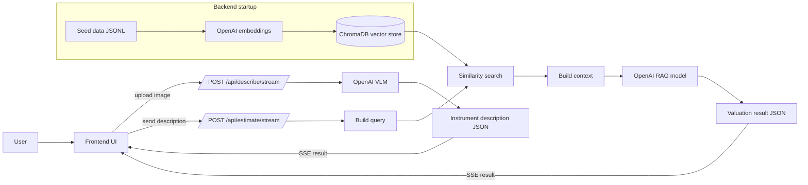

# used-instrument-valuation-poc

## Tech stack

### Backend
- Python 3.11+
- FastAPI
- Uvicorn
- LangChain
- LangChain Community
- LangChain OpenAI
- ChromaDB
- OpenAI API
- Pydantic
- Pydantic Settings
- python-multipart
- uv (package manager/venv)

### Frontend
- React 18
- React DOM
- TypeScript
- Vite
- @vitejs/plugin-react
- Bun (dev server/package manager)

## Processing flow



## Quick start

### Backend (FastAPI + uv)
```bash
cd backend
uv venv --python 3.13
source .venv/bin/activate
uv pip install -e .
cp .env.example .env
# edit .env and set OPENAI_API_KEY
uvicorn app.main:app --reload --port 8000
```

### Frontend (React + Bun)
```bash
cd frontend
bun install
bun run dev
```

### Notes
- The backend uses `chromadb`, which currently requires Python 3.13 or lower.
- The frontend dev server proxies `/api` to `http://localhost:8000`.

## OpenAI model configuration
Set these in `backend/.env` to control which models are used:

```env
OPENAI_API_KEY=your_api_key
OPENAI_VLM_MODEL=gpt-4o-mini
OPENAI_RAG_MODEL=gpt-4.1-mini
OPENAI_EMBED_MODEL=text-embedding-3-large

# GPT-5 examples (pick what your account has access to):
# OPENAI_VLM_MODEL=gpt-5
# OPENAI_RAG_MODEL=gpt-5-mini

# Optional tuning (useful for GPT-5 series / reasoning models)
# OPENAI_REASONING_EFFORT=medium  # none|minimal|low|medium|high|xhigh
# OPENAI_REASONING_SUMMARY=auto   # auto|concise|detailed
# OPENAI_MAX_OUTPUT_TOKENS=2048
# OPENAI_TEMPERATURE=0
# OPENAI_TEXT_VERBOSITY=low       # low|medium|high
# OPENAI_JSON_MODE=true           # enforce JSON output when possible
```

- `OPENAI_VLM_MODEL`: used for image -> description.
- `OPENAI_RAG_MODEL`: used for price estimation synthesis.
- `OPENAI_EMBED_MODEL`: used for vector embeddings.

## One-command dev
Run frontend and backend together:

```bash
./scripts/dev.sh
```

## Deploy to Azure App Service (single container)
这个 repo 可以用「单容器」方式部署到 Azure App Service（Linux / Web App for Containers）：
- 前端：Vite build 后的静态资源
- 后端：FastAPI API（路径前缀 `/api`）

### Quick mental model（先搞清楚原理）
- 你不能把镜像“直接推到 App Service”里；必须先把镜像推到镜像仓库（推荐 ACR）。
- App Service 配置成从仓库“拉取镜像”并运行。
- 运行后：`/` 是前端页面，`/api/*` 是后端 API。

### Prerequisites（必须准备好）
- Docker
- Azure CLI（`az`）并已登录：`az login`
- 一个 Linux 的 App Service（Web App for Containers）

Note：有些版本的 Azure CLI 会打印 `SyntaxWarning: invalid escape sequence`（它自己依赖的 Python 包触发的 warning）。只要命令返回成功即可忽略。

### 0) 先本地跑通（可选但强烈推荐）
```bash
docker build -t used-instrument-valuation-poc .
docker run --rm -p 8000:8000 \
  -e OPENAI_API_KEY=your_api_key \
  used-instrument-valuation-poc
```
打开 `http://localhost:8000/`，健康检查：`http://localhost:8000/api/health`。

### 1) 设定变量（建议直接复制）
把下面变量改成你自己的（这里给的是示例值）：
```bash
RG=used-instrument-valuation
# APP 是 Web App 的资源名（不是域名），可用 `az webapp list -g $RG -o table` 确认
APP=used-instrument-valuation-poc
LOC=japaneast

# ACR 名称必须：全小写、全局唯一。
ACR=usedinstvaluationacr$RANDOM

# 每次部署建议用新 tag（不要一直覆盖同一个 tag）。
IMAGE=usedinst:v1
```

### 2) 创建 ACR（或复用已有的）
先列出 RG 里是否已有 ACR：
```bash
az acr list -g $RG -o table
```

如果没有，就创建一个：
```bash
az group create -n $RG -l $LOC
az acr create -g $RG -n $ACR --sku Basic --admin-enabled true
```

### 3) 构建并推送镜像到 ACR
方式 A（推荐）：用 ACR 云端构建（避免 Mac 本地架构/环境坑）：
```bash
az acr build -g $RG -r $ACR -t $IMAGE .
```

方式 B：本地构建 + push（Apple Silicon 建议推 amd64）：
```bash
ACR_LOGIN_SERVER=$(az acr show -n $ACR --query 'loginServer' -o tsv)
az acr login -n $ACR

docker buildx build --platform linux/amd64 \
  -t $ACR_LOGIN_SERVER/$IMAGE \
  --push .
```

### 4) 确认你的 App Service 是 Linux 容器应用
如果你已经有 App Service，先检查它是不是 Linux 容器：
```bash
az webapp show -g $RG -n $APP --query '{reserved:reserved,linuxFxVersion:siteConfig.linuxFxVersion}' -o json
```
如果 `reserved` 是 `false` 或 `linuxFxVersion` 为空，通常表示你建的是“非容器”的 Web App；需要新建 Linux Web App for Containers。

如需新建 Linux App Service Plan + Web App：
```bash
PLAN=asp-usedinst
az appservice plan create -g $RG -n $PLAN --is-linux --sku B1

ACR_LOGIN_SERVER=$(az acr show -n $ACR --query 'loginServer' -o tsv)
az webapp create -g $RG -p $PLAN -n $APP \
  --deployment-container-image-name $ACR_LOGIN_SERVER/$IMAGE
```

### 5) 配置 Web App 从 ACR 拉取镜像
PoC 最简单的方式是用 ACR admin 账号（生产环境建议改成 Managed Identity）：
```bash
ACR_LOGIN_SERVER=$(az acr show -n $ACR --query 'loginServer' -o tsv)
ACR_USER=$(az acr credential show -n $ACR --query 'username' -o tsv)
ACR_PASS=$(az acr credential show -n $ACR --query 'passwords[0].value' -o tsv)

az webapp config container set -g $RG -n $APP \
  --container-image-name $ACR_LOGIN_SERVER/$IMAGE \
  --container-registry-url https://$ACR_LOGIN_SERVER \
  --container-registry-user $ACR_USER \
  --container-registry-password $ACR_PASS
```

### 6) 配置运行环境变量（App Settings）
必须：
- `WEBSITES_PORT=8000`（容器监听端口，App Service 需要它）
- `OPENAI_API_KEY`（后端必须）

可选：
- `OPENAI_VLM_MODEL`, `OPENAI_RAG_MODEL`, `OPENAI_EMBED_MODEL`
- `RAG_PERSIST_DIR=/home/data/.rag_store`（把 Chroma 的持久化目录放到 `/home`）
- `WEBSITES_ENABLE_APP_SERVICE_STORAGE=true`（开启 `/home` 持久化，让重启后数据不丢）

CLI 示例：
```bash
az webapp config appsettings set -g $RG -n $APP --settings \
  WEBSITES_PORT=8000 \
  OPENAI_API_KEY=your_api_key \
  WEBSITES_ENABLE_APP_SERVICE_STORAGE=true \
  RAG_PERSIST_DIR=/home/data/.rag_store
```

### 7) 重启、看日志、验证访问
重启：
```bash
az webapp restart -g $RG -n $APP
```

实时看日志：
```bash
az webapp log config -g $RG -n $APP --docker-container-logging filesystem
az webapp log tail -g $RG -n $APP
```

验证：
- `https://<your-app>.azurewebsites.net/`
- `https://<your-app>.azurewebsites.net/api/health`

### 8) 更新发布（新 tag）
```bash
IMAGE=usedinst:v2
az acr build -g $RG -r $ACR -t $IMAGE .

ACR_LOGIN_SERVER=$(az acr show -n $ACR --query 'loginServer' -o tsv)
ACR_USER=$(az acr credential show -n $ACR --query 'username' -o tsv)
ACR_PASS=$(az acr credential show -n $ACR --query 'passwords[0].value' -o tsv)

az webapp config container set -g $RG -n $APP \
  --container-image-name $ACR_LOGIN_SERVER/$IMAGE \
  --container-registry-url https://$ACR_LOGIN_SERVER \
  --container-registry-user $ACR_USER \
  --container-registry-password $ACR_PASS

az webapp restart -g $RG -n $APP
```

### Troubleshooting（遇到 Application Error 怎么办）
`Application Error` 通常表示：容器没拉下来 / 容器没启动成功 / 启动了但没在期望端口监听。

1) 确认你用的是 Web App 的资源名（`name`），不要把域名当成 `APP`
- 所有 `az webapp ... -n $APP` 里的 `$APP` 都必须是资源名（`name` 列）。
- 注意：某些环境下 `defaultHostName` 可能会带随机后缀（例如 `used-instrument-valuation-poc-xxxx.centralus-01.azurewebsites.net`），但资源名仍然是 `used-instrument-valuation-poc`。
- 用下面命令一次性把 `name` 和 `host` 对照出来（zsh 记得保留引号）：
  - `az webapp list -g $RG --query "[].{name:name,host:defaultHostName}" -o table`

2) 看容器配置是不是生效了（`linuxFxVersion` 需要以 `DOCKER|` 开头）
```bash
az webapp show -g $RG -n $APP --query '{state:state,linuxFxVersion:siteConfig.linuxFxVersion}' -o json
az webapp config container show -g $RG -n $APP -o json
```

3) 打开并查看容器日志（最关键）
```bash
az webapp log config -g $RG -n $APP --docker-container-logging filesystem
az webapp log tail -g $RG -n $APP
```

常见报错快速定位：
- `unauthorized: authentication required`：ACR 凭证不对/没配置，重跑 “第 5 步” 的 `az webapp config container set ...`
- `exec format error`：推了 arm64 镜像（常见于 Apple Silicon 本地 build），用 “第 3 步方式 A：az acr build” 或 buildx `--platform linux/amd64` 重新推
- `ModuleNotFoundError: No module named 'app.rag'`：镜像里后端包没有包含子包，确保使用最新代码重新 build 并用新 tag 重新部署
- `/api/health` 正常但 `/` 返回 `{"detail":"Not Found"}`：前端构建产物没被找到/提供，访问 `https://<host>/api/_debug/frontend` 查看容器内实际查找路径
- `didn't respond to HTTP pings on port ...`：端口不一致，确认 `WEBSITES_PORT=8000`，且容器内服务监听 `8000`
- `az webapp ssh` 提示 “SSH is not enabled” ：自定义容器默认不带 SSH server；建议先用日志（第 3 步）+ `/api/_debug/frontend` 排查
