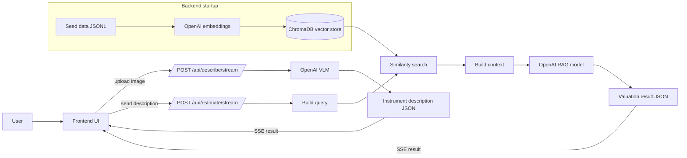

# used-instrument-valuation-poc

## Tech stack

### Backend
- Python 3.11+
- FastAPI
- Uvicorn
- LangChain
- LangChain Community
- LangChain OpenAI
- ChromaDB
- OpenAI API
- Pydantic
- Pydantic Settings
- python-multipart
- uv (package manager/venv)

### Frontend
- React 18
- React DOM
- TypeScript
- Vite
- @vitejs/plugin-react
- Bun (dev server/package manager)

## Processing flow



## Quick start

### Backend (FastAPI + uv)
```bash
cd backend
uv venv --python 3.13
source .venv/bin/activate
uv pip install -e .
cp .env.example .env
# edit .env and set OPENAI_API_KEY
uvicorn app.main:app --reload --port 8000
```

### Frontend (React + Bun)
```bash
cd frontend
bun install
bun run dev
```

### Notes
- The backend uses `chromadb`, which currently requires Python 3.13 or lower.
- The frontend dev server proxies `/api` to `http://localhost:8000`.

## OpenAI model configuration
Set these in `backend/.env` to control which models are used:

```env
OPENAI_API_KEY=your_api_key
OPENAI_VLM_MODEL=gpt-4o-mini
OPENAI_RAG_MODEL=gpt-4.1-mini
OPENAI_EMBED_MODEL=text-embedding-3-large
```

- `OPENAI_VLM_MODEL`: used for image -> description.
- `OPENAI_RAG_MODEL`: used for price estimation synthesis.
- `OPENAI_EMBED_MODEL`: used for vector embeddings.

## One-command dev
Run frontend and backend together:

```bash
./scripts/dev.sh
```
